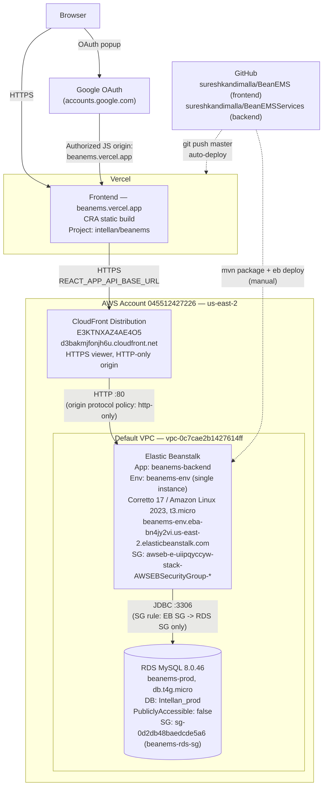

# BeanEMS Deployment Architecture

This document describes how BeanEMS is deployed to production: a React (CRA) frontend on
Vercel, talking over HTTPS through CloudFront to a Spring Boot backend on a single-instance
Elastic Beanstalk environment, backed by a private RDS MySQL instance — all in AWS `us-east-2`.

## Diagram



## Why it's shaped this way

- **Single-instance Elastic Beanstalk, not a load-balanced/auto-scaled environment** — chosen
  explicitly for cost (no hourly ALB charge). Trade-off: no built-in TLS termination, no
  zero-downtime deploys, no horizontal scaling.
- **CloudFront in front of Elastic Beanstalk** — a single-instance EB environment has no managed
  HTTPS. Vercel serves the frontend over HTTPS, and browsers block HTTPS pages from calling an
  HTTP API ("mixed content"). CloudFront terminates HTTPS on AWS's default `*.cloudfront.net`
  certificate for free and forwards to the EB environment over plain HTTP internally — cheaper
  than an Application Load Balancer + ACM certificate for this traffic level.
- **RDS is not publicly accessible** — its security group (`sg-0d2db48baedcde5a6`) only allows
  inbound `3306` from the EB environment's auto-created security group. Nothing on the public
  internet can reach the database directly.

## Components

| Component | Detail |
|---|---|
| Frontend | Vercel project `intellan/beanems`, auto-deploys from `BeanEMS` `master` branch |
| Frontend URL | https://beanems.vercel.app |
| Backend URL (public) | https://d3bakmjfonjh6u.cloudfront.net/api/v1 |
| Backend URL (internal, HTTP only) | http://beanems-env.eba-bn4jy2vi.us-east-2.elasticbeanstalk.com |
| EB Application / Environment | `beanems-backend` / `beanems-env` |
| EB Platform | Corretto 17 running on 64-bit Amazon Linux 2023, `t3.micro`, single instance |
| RDS Instance | `beanems-prod`, MySQL 8.0.46, `db.t4g.micro`, 20GB gp2 — two schemas: `Intellan_prod` (active data) and `Bean-prod` (empty, for switching to) |
| CloudFront Distribution | `E3KTNXAZ4AE4O5` |
| Region | `us-east-2` for all AWS resources |
| AWS Account | `045512427226`, IAM user `Intellan-deploy` |

## Environment variables

**Backend (set via `eb setenv`, read in `application.properties` / `CorsConfig.java`):**

| Variable | Purpose | Local dev default |
|---|---|---|
| `DB_URL` | JDBC connection string | `jdbc:mysql://localhost:3306/Intellan?...` |
| `DB_USERNAME` | RDS master username | `root` |
| `DB_PASSWORD` | RDS master password (rotated after initial setup; stored only in EB env config) | `root` |
| `SERVER_PORT` | Must be `5000` in production — EB's nginx proxies to port 5000 by default, while Spring Boot's own default is 8080 | unset (defaults to 8080) |
| `CORS_ALLOWED_ORIGINS` | Comma-separated allowed origins, must include `https://beanems.vercel.app` in prod | `http://localhost:3000,3001,4000,4200` |

### Switching between the two RDS schemas

`beanems-prod` holds two schemas — `Intellan_prod` (the active one) and `Bean-prod` (created
empty, for switching to). Switching is just a `DB_URL` change:

```bash
# Switch to Bean-prod
eb setenv DB_URL="jdbc:mysql://beanems-prod.cr2qoysokxkn.us-east-2.rds.amazonaws.com:3306/Bean-prod?allowPublicKeyRetrieval=true&useSSL=false" --environment beanems-env

# Switch back to Intellan_prod
eb setenv DB_URL="jdbc:mysql://beanems-prod.cr2qoysokxkn.us-east-2.rds.amazonaws.com:3306/Intellan_prod?allowPublicKeyRetrieval=true&useSSL=false" --environment beanems-env
```

Each triggers an EB environment update (~1-2 min restart). `Bean-prod` is empty — with
`spring.jpa.hibernate.ddl-auto=update` on, the first connection auto-creates every table, then
the app's "Master Data Load" page can populate it.

**Frontend (set via `vercel env add`, Production scope):**

| Variable | Purpose |
|---|---|
| `REACT_APP_API_BASE_URL` | `https://d3bakmjfonjh6u.cloudfront.net/api/v1` — baked into the JS bundle at build time |
| `CI` | Set to `false` — CRA's `react-scripts build` treats ESLint warnings as fatal errors when `CI=true`, which Vercel sets by default |

**Google OAuth:** Client ID is hardcoded in `src/App.jsx` (not an env var). Its "Authorized
JavaScript origins" in [Google Cloud Console](https://console.cloud.google.com/apis/credentials)
must include `https://beanems.vercel.app` — this is UI-only, not settable via CLI.

## Redeploying

**Frontend:**
```bash
npx vercel --prod --yes
```
Or just `git push` to `master` — Vercel's GitHub integration auto-deploys.

**Backend:**
```bash
# Lombok 1.18.26 doesn't run correctly under JDK 23 (Homebrew's default) —
# use the installed JDK 19 explicitly.
JAVA_HOME=/Users/sureshkandimalla/Library/Java/JavaVirtualMachines/openjdk-19.0.2/Contents/Home \
  mvn clean package -DskipTests
cp target/springboot_mysql_project-0.0.1-SNAPSHOT.jar application.jar
eb deploy beanems-env --staged   # requires `git add -f application.jar` first (gitignored)
```
If `eb deploy` fails with an S3 `ListBucketMultipartUploads` permission error (the IAM user's
policy doesn't grant it), upload manually instead:
```bash
VERSION_LABEL="app-manual-$(date +%y%m%d_%H%M%S)"
zip -q -X /tmp/deploy.zip Procfile application.jar
aws s3api put-object --bucket elasticbeanstalk-us-east-2-045512427226 \
  --key "beanems-backend/${VERSION_LABEL}.zip" --body /tmp/deploy.zip --region us-east-2
aws elasticbeanstalk create-application-version --application-name beanems-backend \
  --version-label "$VERSION_LABEL" \
  --source-bundle S3Bucket=elasticbeanstalk-us-east-2-045512427226,S3Key="beanems-backend/${VERSION_LABEL}.zip" \
  --region us-east-2
aws elasticbeanstalk update-environment --environment-name beanems-env \
  --version-label "$VERSION_LABEL" --region us-east-2
```

## Security notes

- RDS `beanems-prod` is not publicly accessible; only the EB environment's security group can
  reach it on 3306.
- The RDS master password was rotated once (after being pasted in plaintext during initial
  setup) and now exists only in the EB environment's configuration — not in git, not in chat,
  not in any file in this repo.
- The IAM user `Intellan-deploy` is scoped to `AmazonRDSFullAccess` +
  `AdministratorAccess-AWSElasticBeanstalk` + `CloudFrontFullAccess` + `IAMReadOnlyAccess` — no
  broader EC2/S3 access (hence the key-pair and multipart-upload workarounds above).
